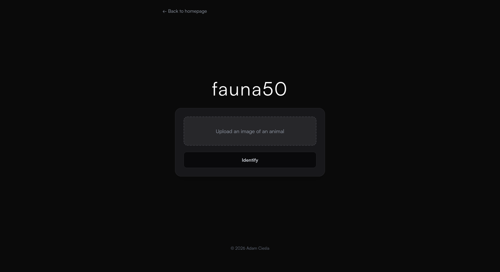
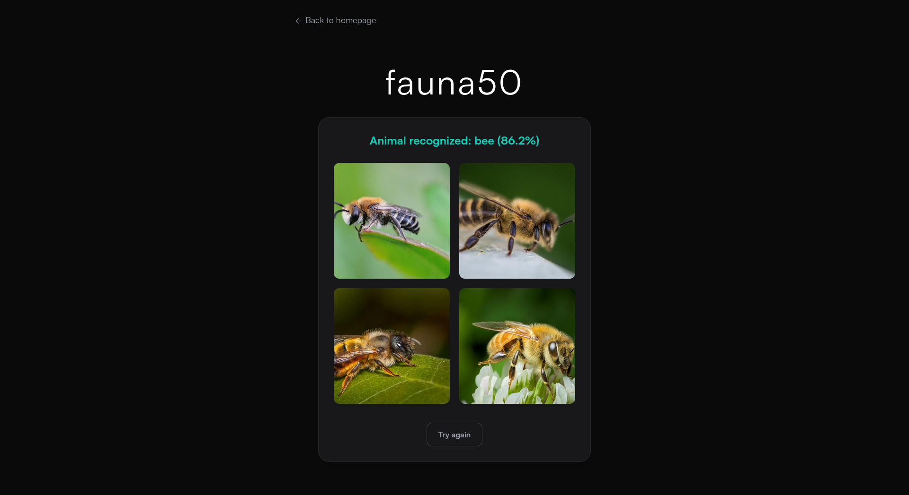

# fauna50

A web application for animal species classification, built as a final project for Harvard's [CS50x: Introduction to Computer Science](https://cs50.harvard.edu/x/) course.

Upload a photo of an animal, and the app will identify its species using a pre-trained Vision Transformer (ViT) model from Hugging Face.

**Live:** [https://fauna50.adamciesla.com](https://fauna50.adamciesla.com) (might take a while to load the image)

---

## Screenshots




---

## Features

- **Vision Recognition**: Utilizes the **Vision Transformer (ViT)** architecture (`google/vit-base-patch16-224`) to classify animal species.
- **Data Validation**: Implements a logic layer to distinguish between animals and inanimate objects. If a user uploads a photo of an apple or a car, the system detects it's not an animal and rejects the input (Data Quality control).
- **Data Enrichment**: Automatically fetches similar images from the web using DuckDuckGo Search API (`ddgs`) to provide visual context for the classification result.
- **Modern UI**: Features a fully responsive, dark-mode interface built with **Tailwind CSS**.

---

## Tech Stack

- **Backend**: [`Flask`](https://flask.palletsprojects.com/en/stable/)
- **Frontend**: [`Tailwind CSS`](https://tailwindcss.com/)
- **ML**: Hugging Face [`transformers`](https://huggingface.co/docs/transformers/installation) library (with PyTorch)
- **Model**: [`google/vit-base-patch16-224`](https://huggingface.co/google/vit-base-patch16-224) (Vision Transformer)
- **Image Processing**: [`Pillow (PIL)`](https://pillow.readthedocs.io/en/stable/)
- **Utilities**: `duckduckgo-search` (Web Scraping/API)
- **Deployment**: [`Render.com`](https://render.com/)

---

## Project Structure

```text
fauna50/
├── app.py              # Main Flask application
├── model/
│   └── model.py        # ML logic: loads ViT model and runs inference
├── static/
│   ├── css/            # Compiled Tailwind CSS files
│   └── js/
│       └── main.js     # Frontend logic
├── templates/
│   └── index.html      # Main HTML template
├── package.json        # Node.js dependencies (Tailwind CSS)
└── requirements.txt    # Python dependencies
```

## Getting Started

Follow the instructions below if you want to get a copy of this project running on your local machine.

### 1. Prerequisites

- `Python 3.8+`
- `Node.js`
- `Git`
- `venv` module

### 2. Installation

1.  **Clone the repository**

    ```bash
    git clone https://github.com/cieslaa/fauna50.git
    cd fauna50
    ```

2.  **Set up a Python virtual environment**

    ```bash
    # Windows
    python -m venv .venv
    .venv\Scripts\activate

    # macOS/Linux
    python3 -m venv .venv
    source .venv/bin/activate
    ```

3.  **Install Python dependencies**

    ```bash
    pip install -r requirements.txt
    ```

4.  **Install Node.js dependencies**
    ```bash
    npm install
    ```

### 3. Running the app

You need to run two processes simultaneously in separate terminal windows:

```bash
npm run watch
```

```bash
flask run
```

---

## License

This project is licensed under the GNU General Public License v3.0 – see [LICENSE](LICENSE) for details.
